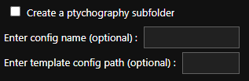
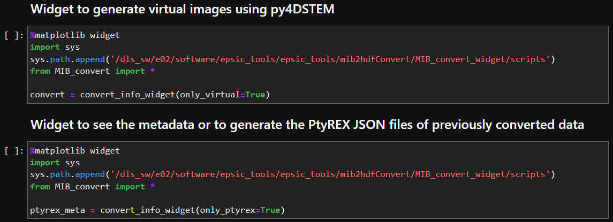

# MIB conversion
- The format of raw 4DSTEM data is '.mib'
- After acquiring the data, the mib files must be converted into the 'hdf5' files using 'MIB_conversion/MIB_convert.ipynb'
- hdf5 files can be read using 'H5PY' or 'HyperSpy' ([Example](https://github.com/jinseuk56/User-Notebooks/blob/master/ePSIC_Standard_Notebooks/automatic_Au_xgrating_calibration/au_xgrating_cal_submit.ipynb))

- Currently, when the data is acquired simultaneously with EDX, the scan shape must be manually specified using 'known_shape' widget (make sure that 'Use Fly-back' is unchecked in this case) - the scan shape must be (Scan_X, Scan_Y) = (Scan_X, Scan_X-1)
- But, in most cases, 'Auto reshape' will determine the scan shape, so you don't have to use other options for reshaping

- The necessary options to specify are normally:  
    - 'Year'
    - 'Session'
    - 'Subfolder' or 'All MIB files in 'Merlin' folder'
    - 'Auto reshape' (optionally 'Use Fly-back' or 'Known_shape' and enter the scan shape)
    - 'Create slurm batch file'
    - 'Create conversion info file'
    - 'Submit a slurm job'
- 'Create virtual images' is made for atomic resolution 4DSTEM data, so it's unlikely to work properly for pencil beam 4DSTEM data
- 'Create virtual images', 'DPC' and 'Parallax' use the relevant methods of py4DSTEM

- 'Create a ptychography subfolder' will generate a PtyREX parameter file for each 4DSTEM data

- The other individual cells in the notebook are made for previously converted 4DSTEM data

# Variable list
### year 
year of the session, e.g., 202X  
### session
session referenc e.g., mgXXXXX-X
### All MIB files in 'Merlin' folder:
if checked and no subfolder name is specified, all MIB files in 'Merlin' folder will be converted
### subfolder
subfolder name, it has a higher priority than the widget above
### Show the path of each MIB file
if checked, the paths of the MIB files that will be converted are shown
### No reshaping
if checked, the scan region will not be reshaped into 2D scan dimensions
### Use Fly-back
if checked, the scan region will be completely recovered.
### Known_shape
if checked, the scan region will be reshaped as you want (if possible)
### Scan_X
x-axis dimension of the scan region for the 'Known_shape' option
### Scan_Y
y-axis dimension of the scan region for the 'Known_shape' option
### Create virtual images
if checked, virtual images such BF-STEM and ADF-STEM will be generated using py4DSTEM in the save directory    
### Lower threshold value to detect the disk
lower threshold value to detect the center disk
### Upper threshold value to detect the disk
upper threshold value to detect the center disk   
### Enter the mask file path (optional)
mask file path
### DPC
if checked, CoM and iCoM DPC images will be generated
### DPC low pass
low pass filter for iCoM DPC image
### DPC high pass
high pass filter for iCoM DPC image
### Parallax
if checked, virtual parallax images and expected experimental conditions will be calculated
### Bin_nav
rebin the data for the scan shape and save it as a HSPY file
### Bin_sig
rebin the data for the diffraction shape and save it as a HSPY file
### Create slurm batch file
if checked, the slurm batch file will be created in the save directory
### Create conversion info file
if checked, the information file for the MIB conversion will be created in the save directory
### Create a ptychography subfolder
if checked, the json file for the ptyrex reconstruction will be created in the save directory
### Enter config name (optional)
PtyREX recontruction name
### Enter template config path (optional)
PtyREX template json file path you want to use
### Select the cluster node (cs04r recommended)
select the cluster node to use. 'cs05r' is the GPU cluster node, so please do not use it unnecessarily
